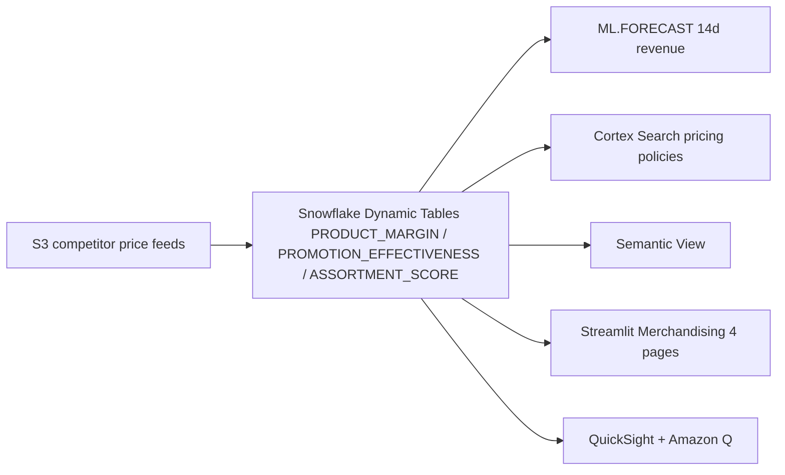

# Merchandising & Pricing Analytics

AI-powered merchandising platform for category managers — interactive margin treemaps, promotion ROI analysis, competitive pricing intelligence, and demand forecasting.

## Architecture

A merchandising and pricing analytics platform built on **Snowflake** (Dynamic Tables, ML.FORECAST, Cortex Search, semantic view, Cortex Analyst) and **AWS** (S3, QuickSight + Amazon Q). Competitor price feeds land in S3; Snowflake builds the curated layer with margin, promotion, and assortment scores; the VP asks Amazon Q "Which promotions had negative ROI?"



## Snowflake Capabilities

| Capability | Implementation |
|-----------|---------------|
| Dynamic Tables | PRODUCT_MARGIN / PROMOTION_EFFECTIVENESS / ASSORTMENT_SCORE |
| ML Functions | ML.FORECAST 14-day category revenue predictions |
| Cortex Search | 50 category-specific pricing policies indexed |
| Cortex Agent | MerchandisingAnalyst + PricingPolicySearch tools |
| Semantic View | Structured analytics over margins, promotions, assortment |
| Streamlit | 4-page dashboard: Margins / Promotions / Competitive / Assortment |

## AWS Services

| Service | Role in Demo |
|---------|-------------|
| Amazon S3 | Competitor price feed ingestion |
| Amazon QuickSight | Executive merchandising and pricing dashboard |
| Amazon Q | Natural language analytics for VP Merchandising |

## Personas

| Persona | Role | Key Questions |
|---------|------|---------------|
| **Category Manager** | Manages product margins and promotions | "Which categories have margin erosion?" "What's the ROI on current promotions?" |
| **VP Merchandising** | Strategic pricing and assortment decisions | "Which promotions had negative ROI?" "How do we compare to competitors?" |

## Data

| Table | Rows | Description |
|-------|------|-------------|
| PRODUCTS | 1,000 | SKUs with brand, category, base_price, cost |
| STORES | 50 | APJ retail locations across 4 formats |
| SALES | 200,000 | Transaction-level with quantity, price, discount |
| PROMOTIONS | 500 | BOGO, percentage, bundle, loyalty multiplier |
| PROMO_PRODUCTS | 2,000 | Product-promotion mappings |
| COMPETITOR_PRICES | 50,000 | FairPrice, Cold Storage, Giant, Sheng Siong, Amazon Fresh |
| PRICING_POLICIES | 50 | Category-specific pricing rules and constraints |

## Build Instructions

### Prerequisites
- Snowflake account with ACCOUNTADMIN access
- Cortex AI enabled (ML Functions, Search, Agent)
- Warehouse: CORTEX (Medium)

### Deployment

```bash
snowsql -f snowflake/00_setup.sql
snowsql -f snowflake/01_raw_tables.sql
snowsql -f snowflake/02_staging.sql
snowsql -f snowflake/03_dynamic_tables.sql
snowsql -f snowflake/04_search.sql
snowsql -f snowflake/05_ml_models.sql
snowsql -f snowflake/06_semantic_view.sql
snowsql -f snowflake/07_agent.sql
```

### Streamlit App
```
RETAIL_MERCHANDISING.APP.MERCHANDISING_APP
```

## Key Demo Numbers

- **1,000 SKUs** with real-time margin tracking across 50 stores
- **50,000 competitor prices** from 5 Singapore retailers
- **Plotly treemap** — interactive margin visualization (size=revenue, color=margin%)
- **14-day demand forecast** per product for assortment optimization

## License

Apache 2.0 — See [LICENSE](LICENSE) for details. This is a personal project and is not an official Snowflake offering. It comes with no support or warranty. Use it at your own risk. Snowflake has no obligation to maintain, update, or support this code. Do not use this code in production without thorough review and testing.
