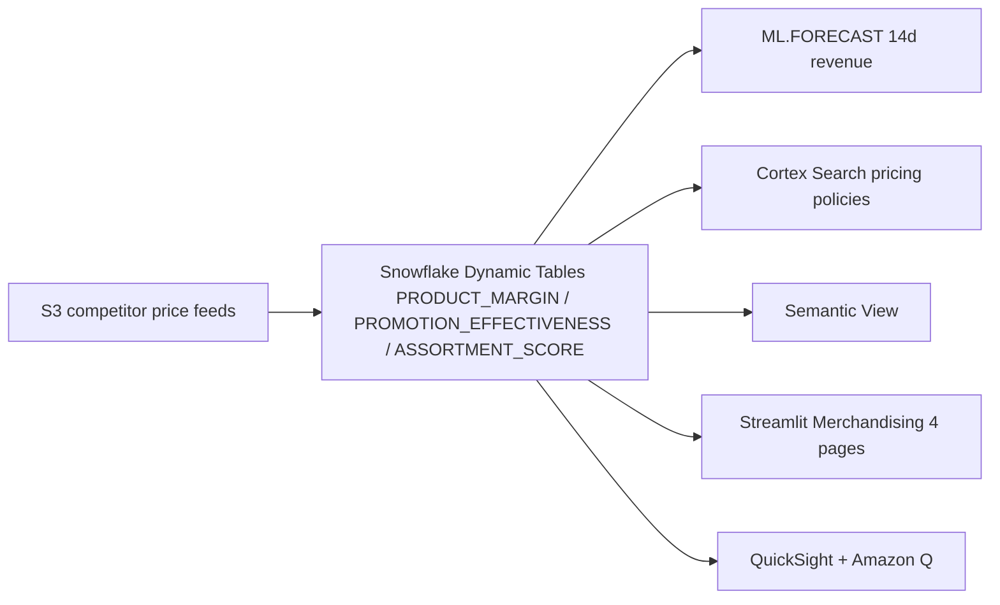

# Merchandising & Pricing — Reference Architecture Demo
### Snowflake + AWS S3 (competitor feeds) + QuickSight + Amazon Q | Retail/CPG

> A dual-persona merchandising analytics platform — Category Managers explore margins and promotions in a Plotly-powered multi-page Streamlit app, while the VP Merchandising asks Amazon Q "Which promotions had negative ROI?"

## Key Differentiators

- **Multi-page app** (not tabs) — `st.navigation` with 4 distinct pages
- **Plotly treemap** hero — interactive margin visualization (size=revenue, color=margin%)
- **Dual-persona** — Streamlit for tactical, QuickSight+Q for strategic
- **No Bedrock** — Cortex AI handles all intelligence natively
- **S3 competitor feeds** — external market pricing data ingestion

## Architecture

A merchandising and pricing analytics platform built on **Snowflake** (Dynamic Tables, ML.FORECAST, Cortex Search, semantic view, Cortex Analyst) and **AWS** (S3, QuickSight + Amazon Q). Competitor price feeds land in S3; Snowflake builds the curated layer with margin, promotion, and assortment scores; the VP asks Amazon Q "Which promotions had negative ROI?"

## Data

| Table | Rows | Content |
|---|---|---|
| PRODUCTS | 1,000 | SKUs with brand, category, base_price, cost |
| STORES | 50 | APJ retail locations across 4 formats |
| SALES | 200,000 | Transaction-level with quantity, price, discount |
| PROMOTIONS | 500 | BOGO, percentage, bundle, loyalty multiplier |
| PROMO_PRODUCTS | 2,000 | Product-promotion mappings |
| COMPETITOR_PRICES | 50,000 | FairPrice, Cold Storage, Giant, Sheng Siong, Amazon Fresh |
| PRICING_POLICIES | 50 | Category-specific pricing rules and constraints |

## Streamlit Pages

| Page | Hero Visual | Key Capability |
|---|---|---|
| Margins | **Plotly treemap** (category>brand>product) | Dynamic Tables + competitor data |
| Promotions | Scatter plot (discount vs revenue) | Promotion DT analytics |
| Competitive | Grouped bar (price index by competitor) | Cortex Search + S3 feeds |
| Assortment | Stacked bar (ABC by store) + forecast line | ML FORECAST |

## Legal

This is a personal project and is **not an official Snowflake offering**.
